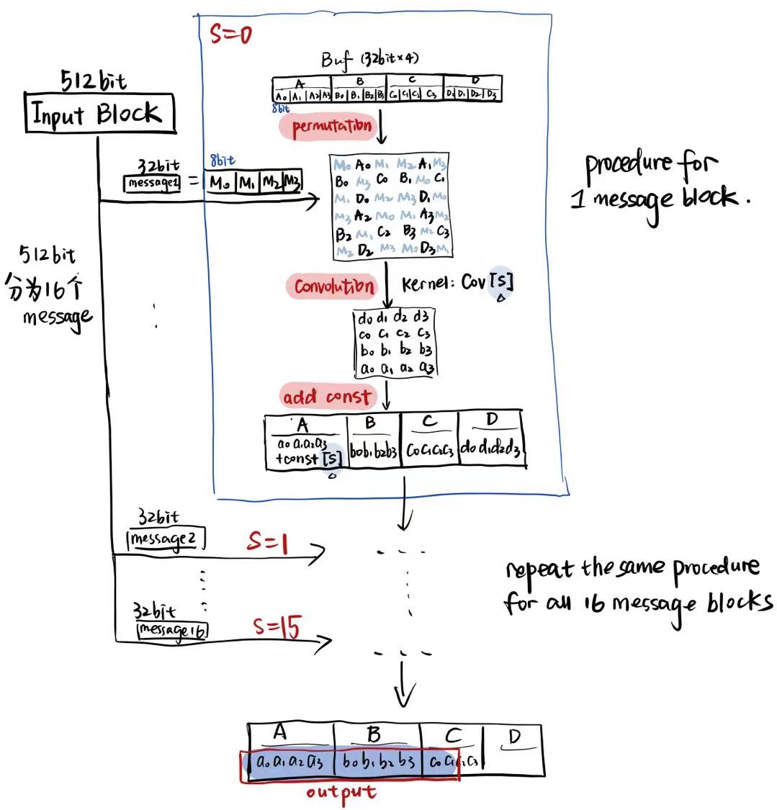
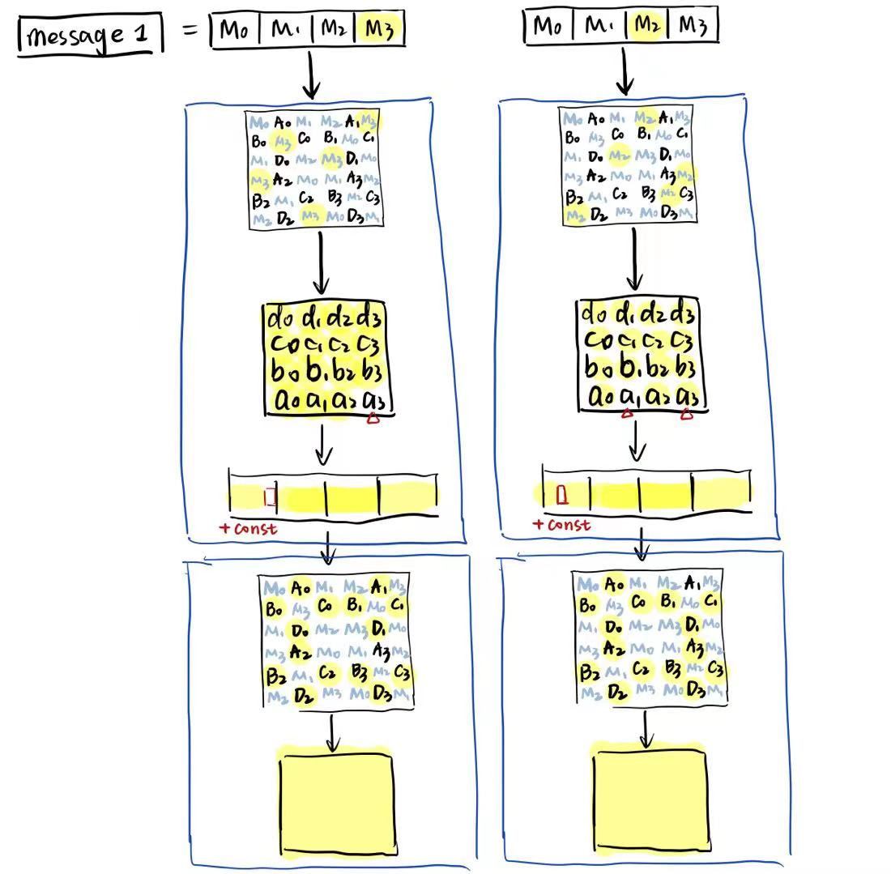

# Unbreakable Wide-Pipe (UWP): A Novel Hash Function Based on Wide-Pipe Structure

### 0. Idea

Convolution, as a component for extracting input features, is widely used in various neural networks. We use convolution as the linear component in encryption, attempting to extract plaintext features through convolution. Since the output of convolution can integrate information within a range, it can also achieve the effect of fully mixing and diffusing plaintext.

### 1. Encryption Process

First, pad the message and divide it into N * 512bit Input Blocks.

For each 512bit Input Block, divide it into 16 * 32bit Message[s] (s=0,1,…,15), each Message input is encrypted once, updating the Buffer array, a total of 16 updates.

The encryption process for each Message[s] is as follows:

- First, divide both Message and Buffer into 8bit bytes (the following representations are all high bits on the left)
  - Buffer: A0-A3, B0-B3, C0-C3, D0-D3
  - Message: M0-M3
- Then arrange (Permutation) into a 6 _ 6 matrix form, pass through a convolution kernel C[s] output a 4 _ 4 matrix
- Combine the output matrix into 4 * 32bit A, B, C, D, add a constant bias on A: consts[s].
- Combine ABCD into Buffer.

Due to the use of Wide-pipe structure, the output of the last Input Block is 80bit.

In order to improve computational efficiency, we manually derived the weighting formula for each byte. Therefore, during computation, only linear weighting is needed without involving convolution form.

### 2. Kernel and Constant Generation

- IV vector:

  Composed of student numbers 2019010229, 2020012353 and arithmetic constant (987654321234)

- 16 convolution kernels: generated using sin function. The value of row i column j (0<=i, j<=2) of the s(0<=s<=15) convolution kernel is calculated as follows:

  Kernel [ s ] [ i ] [ j ] = int (256 _ sin(s _ 16 + 3 * i + j)).

- 16 constants:

  - Constants 0 ~ 5: taken from the first 12 digits of the hexadecimal representation of the golden ratio (1+sqrt(5)) / 2
  - Constants 6 ~ 11: taken from the first 12 digits of pi hexadecimal representation
  - Constants 12 ~ 15: taken from the first 8 digits of e hexadecimal representation

### 3. Security Analysis

#### Diffusion

Assuming a byte in message changes, this change will diffuse to 15/16 of Buffer in one step and to all Buffer bytes in two steps. The figure below takes M3 and M2 changes as examples, with highlighted bytes affected by changes.

#### Randomness Test

Convert pi to binary representation and take its first 4000 bits. Each group of 80 bits generates a hash value of length 80 bits. There are a total of 500 hash values with a total length of 4000 bits. Take bitstream =10:

| P-VALUE  | STATISTICAL TEST         | PASS PROPORTION |
| :------- | :----------------------- | :-------------- |
| 0.911413 | Frequency                | 10/10           |
| 0.739918 | Block Frequency          | 10/10           |
| 0.911413 | Cumulative Sums          | 10/10           |
| 0.350485 | Cumulative Sums          | 10/10           |
| 0.066882 | Runs                     | 10/10           |
| 0.534146 | Longest Run              | 10/10           |
| 0.122325 | FFT                      | 10/10           |
| 0.350485 | Approximate Entropy      | 10/10           |
| ------   | Non Overlapping Template | 1439/1480       |
| 0.213309 | Linear Complexity        | 9/10            |
| 0.066882 | Serial                   | 8/10            |

The complete report can be found at `outputs/finalAnalysisReport.txt`.

### 4. Efficiency Test

OS: WSL2

CPU: Intel® Core™ i7-10510U CPU @1.80GHz2.30 GHz

Compiler: g++

Compilation options: -O3

Test result: 431.36 Mbps.
